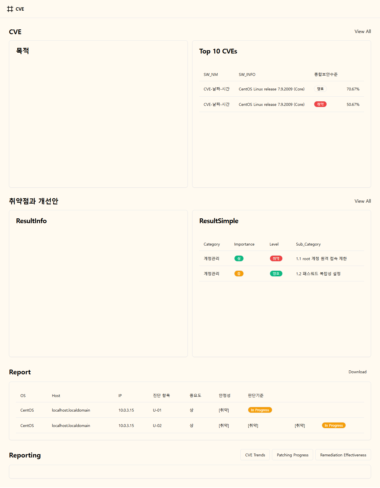

### 💡목적  
인프라 취약점 진단 가시화  

 
---
### 💡샘플 이미지

 
---
### 💡Front - Directory Structure

| 폴더   | 설명 |
|---|--|
| templates  | 환경 설정에서 Thymeleaf가 시작되는 페이지로 지정한 최상위 디렉터리입니다.                       |
| templates/common | 공통으로 사용되는 페이지에 대한 상위 디렉터리로 구성하였습니다.                                 |
| templates/fragment  | 모든 페이지에서 출력이 되는 config,content,footer,header,nav에 대한 디렉터리로 구성하였습니다. |
| templates/layout | Fragments에 구성한 파일들을 해당 페이지에서 엮어주는 용도로 디렉터리를 구성하였습니다.                |
| templates/pages  | 개별 페이지를 관리하는 상위 디렉터리로 구성하였습니다.                                      |

| 파일     | 설명 |
|--------------------|-----------------------------------------------------------------|
| config.html        | 공통 JS, CSS를 초기 파일에 불러올 수 있도록 구성하였습니다.                           |
| header.html        | Header 영역의 화면에 대한 목적으로 구성하였습니다.                                 |
| footer.html	       | Footer 영역의 화면에 대한 목적으로 구성하였습니다.                                 |
| nav.html	          | Nav 영역의 화면에 대한 목적으로 구성하였습니다.                                    |
| defaultLayout.html | 구성한 파일들(config,content,footer,header,nav)을 엮어주기 위한 목적으로 구성하였습니다. |
| home.html          | defaultLayout을 불러오며 Content 영역에 해당하고 화면 별 내용이 들어가는 목적으로 구성하였습니다 |
	
|  속성  | 설명 |
|---|-----------|
| xmlns:th="http://www.thymeleaf.org"  | Thymeleaf Template이라고 선언합니다                                                          |
| xmlns:layout="http://www.ultraq.net.nz/thymeleaf/layout"  | Thymeleaf-layout을 사용함을 선언합니다.                                                        |
| layout:fragment  | 해당 속성은 지정한 영역(태그 범위)을 기준으로 Fragment임을 선언합니다.                                         |
| th:replace  | - 해당 속성은 fragment에서 지정된 태그 영역을 불러오는데 사용합니다.  - 경로로 해당 파일을 찾아서 :: 을 이용하여 Alias를 지정합니다. |
| layout:decorate  | - 해당 속성은 구성한 레이아웃을 경로로 불러올때 사용합니다.  - 업무 페이지에서 레이아웃 경로를 불러와야 Fragment를 사용할 수 있습니다.    |
